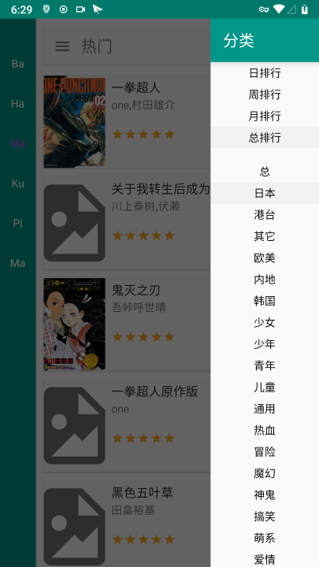

# MHViewer

这是一个Android 平台的第三方漫画浏览器。

A comic browser for Android.

使用说明：[350722@bangumi](http://bangumi.tv/group/topic/350722)

# Screenshot

# Build

Windows

    > git clone https://github.com/axlecho/MHViewer.git
    > cd MHViewer
    > gradlew app:assembleDebug

Linux

    $ git clone https://github.com/axlecho/MHViewer.git
    $ cd MHViewer
    $ ./gradlew app:assembleDebug

生成的 apk 文件在 app\build\outputs\apk 目录下

The apk is in app\build\outputs\apk

# Thanks

本项目受到了诸多开源项目的帮助

Here is the libraries

- [EhViewer](https://github.com/seven332/EhViewer)
- [AOSP](http://source.android.com/)
- [android-advancedrecyclerview](https://github.com/h6ah4i/android-advancedrecyclerview)
- [Apache Commons Lang](https://commons.apache.org/proper/commons-lang/)
- [apng](http://apng.sourceforge.net/)
- [giflib](http://giflib.sourceforge.net)
- [greenDAO](https://github.com/greenrobot/greenDAO)
- [jsoup](https://github.com/jhy/jsoup)
- [libjpeg-turbo](http://libjpeg-turbo.virtualgl.org/)
- [libpng](http://www.libpng.org/pub/png/libpng.html)
- [okhttp](https://github.com/square/okhttp)
- [roaster](https://github.com/forge/roaster)
- [ShowcaseView](https://github.com/amlcurran/ShowcaseView)
- [Slabo](https://github.com/TiroTypeworks/Slabo)
- [TagSoup](http://home.ccil.org/~cowan/tagsoup/)

# License

    Copyright (C) 2014-2019 Axlecho

    Licensed under the Apache License, Version 2.0 (the "License");
    you may not use this file except in compliance with the License.
    You may obtain a copy of the License at

        http://www.apache.org/licenses/LICENSE-2.0

    Unless required by applicable law or agreed to in writing, software
    distributed under the License is distributed on an "AS IS" BASIS,
    WITHOUT WARRANTIES OR CONDITIONS OF ANY KIND, either express or implied.
    See the License for the specific language governing permissions and
    limitations under the License.
